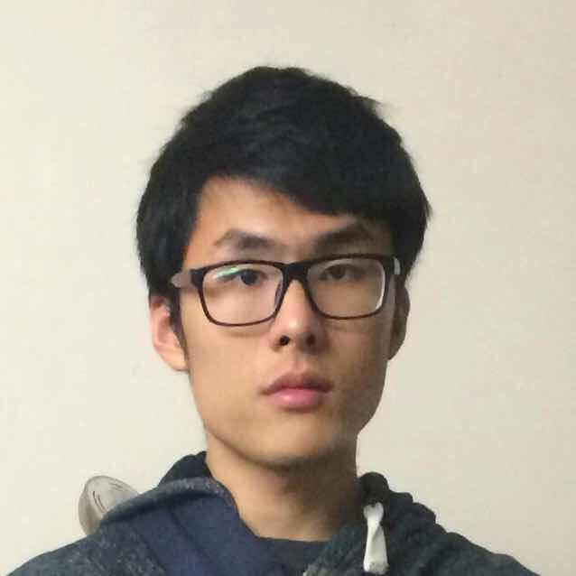

---
---

<link rel="stylesheet" href="styles.css" type="text/css">

&nbsp;&nbsp;

&nbsp;&nbsp;

&nbsp;&nbsp;

&nbsp;&nbsp;

Hello! I am interested in computational statistics and statistical genetics. 

I graduated from the [University of Waterloo](https://uwaterloo.ca/statistics-and-actuarial-science/) with a MMath in Statistics in 2019. Currently I investigate questions related to cancer evolutionary process at [Ontario Institute for Cancer Research](https://oicr.on.ca/). In Sepetember 2019, I will pursue Ph.D. in Biostatistics at the [University of Toronto](http://www.dlsph.utoronto.ca/division/biostatistics/).

&nbsp;&nbsp;

&nbsp;&nbsp;

---

